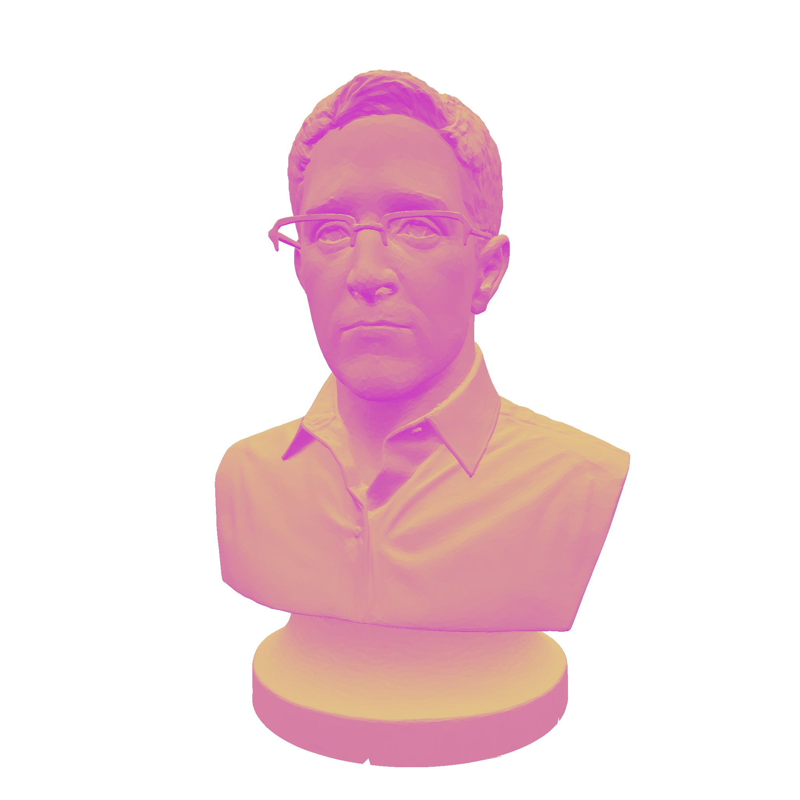

# three-png-stream

[](http://github.com/badges/stability-badges)

Streams a PNG encoded pixels from a ThreeJS `WebGLRenderTarget`. This is done in chunks of `gl.readPixels`, using [gl-pixel-stream](https://github.com/Jam3/gl-pixel-stream), and works with render targets upwards of 10000x10000 pixels in Chrome (or more, depending on your GPU).

The following transparent PNG image was generated with ThreeJS on the client side using the [example/](./example) code. See [Running from Source](#running-from-source) for details.



> *Note:* This only works on Three r69-71 and 74+.

## Install

```sh
npm install three-png-stream --save
```

## Example

```js
var pngStream = require('three-png-stream')

// this will decide the output image size
var target = new THREE.WebGLRenderTarget(512, 512)

// draw your scene into the target
renderer.render(scene, camera, target)

// now you can write it to a new PNG file
var output = fs.createWriteStream('image.png')
pngStream(renderer, target)
  .pipe(output)
```

## Usage

[](https://www.npmjs.com/package/three-png-stream)

#### `stream = pngStream(renderer, target, [opt])`

Creates a new `stream` which reads pixel data from `target` in chunks, writing PNG encoded data.

- `renderer` is the WebGLRenderer of ThreeJS
- `target` is the WebGLRenderTarget; you must render to it first!
- `opt` are some optional settings:
  - `chunkSize` number of rows of pixels to read per chunk, default 128
  - `flipY` whether to flip the output on the Y axis, default `true`
  - `format` a THREE texture format to use, defaults to the format in `target`
  - `stride` the number of channels per pixel, guessed from the format (default 4)
  - `onProgress` the progress function for `gl-pixel-stream`, which has an event parameter with `current`, `total` and `bounds` for the current readPixel boudns

## Running From Source

Clone and install:

```sh
git clone https://github.com/Jam3/three-png-stream.git
cd three-png-stream
npm install
```

Now run the following:

```sh
npm run start
```

And open the development server at [http://localhost:9966/](http://localhost:9966/). Once the model appears, click anywhere to save a new `snowden.png` to the example folder. You can also change the `outputWidth` and `outputHeight`, the max size is generally GPU-dependent. This is best used in Chrome.

## License

MIT, see [LICENSE.md](http://github.com/Jam3/three-png-stream/blob/master/LICENSE.md) for details.
